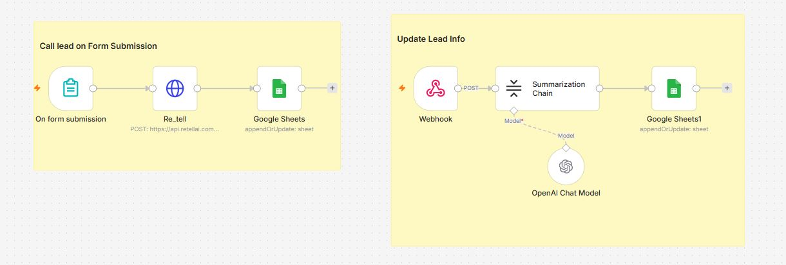

# 📞 Lead Qualification Voice AI Agent using n8n, ReTell AI & OpenAI


---

# 📖 Overview

This repository contains an **AI-powered Lead Qualification System** built using **n8n**, **ReTell AI Voice Agent**, **OpenAI**, and **Google Sheets**.

The project consists of **two connected workflows**:

* 📞 **Workflow 1:** Automatically initiates an outbound AI voice call whenever a new lead submits a form.
* 🧠 **Workflow 2:** Receives the conversation transcript through a webhook, summarizes the discussion using OpenAI, extracts important lead details, and stores the structured information in Google Sheets.

This automation reduces manual lead qualification, accelerates sales follow-ups, and provides structured lead information for CRM systems.

---

# 🖼️ Workflow Layout



---

# ✨ Features

* 📋 Trigger on new form submission
* ☎️ Automatic outbound AI phone call
* 🤖 AI-driven voice conversation
* 🔗 Webhook integration for conversation results
* 🧠 AI transcript summarization
* 📝 Lead qualification extraction
* 📊 Store structured lead information in Google Sheets
* ⚡ Fully automated sales qualification workflow

---

# 🎯 Use Cases

### 📞 Sales Lead Qualification

Automatically contact newly submitted leads and qualify them before a salesperson reaches out.

---

### 🏢 Real Estate Agencies

Collect buyer requirements and summarize property preferences.

---

### 💼 Insurance Companies

Pre-qualify customers before assigning them to an advisor.

---

### 🚗 Automobile Dealerships

Understand customer vehicle preferences before scheduling test drives.

---

### 🎓 Educational Institutes

Qualify admission inquiries automatically.

---

### 🏥 Healthcare Clinics

Collect appointment requirements and patient information before scheduling.

---

# 🔄 Workflow Components

This repository contains **two workflows**.

---

# 📞 Workflow 1 — Call Lead on Form Submission

## 📝 Purpose

Automatically calls every new lead using a Voice AI Agent immediately after form submission.

---

## ⚙️ Nodes

### 1️⃣ On Form Submission

**Node Type**

Form Trigger

**Purpose**

Starts the workflow whenever a visitor submits a lead form.

Typical captured fields include:

* Name
* Email
* Phone Number
* Company
* Inquiry

---

### 2️⃣ ReTell AI

**Node Type**

HTTP Request

**Purpose**

Creates an outbound AI phone call.

**Method**

POST

**Example Endpoint**

```text
https://api.retellai.com/v2/create-phone-call
```

The request sends:

* Customer Name
* Phone Number
* AI Agent ID
* Call Instructions

---

### 3️⃣ Google Sheets

**Node Type**

Append or Update Row

**Purpose**

Stores the newly submitted lead before the AI call begins.

Typical fields:

* Name
* Phone
* Email
* Lead Status
* Call Status
* Created Time

---

# 🧠 Workflow 2 — AI Lead Summarization

## 📝 Purpose

Processes the completed AI conversation and extracts structured lead information.

---

## ⚙️ Nodes

### 1️⃣ Webhook

Receives the completed conversation from ReTell AI.

Payload includes:

* Transcript
* Call Duration
* Customer Information
* Recording URL
* Call Status

---

### 2️⃣ Summarization Chain

Uses OpenAI to:

* Summarize conversation
* Detect customer intent
* Identify product interest
* Estimate buying readiness
* Extract follow-up actions

---

### 3️⃣ Google Sheets

Updates the lead record with

* Conversation Summary
* Lead Score
* Budget
* Timeline
* Interest Level
* Next Action
* Qualified Status

---

# 🔐 Required Credentials

## 🤖 OpenAI

### Required

* OpenAI API Key

### Used For

* Transcript summarization
* Lead qualification
* Information extraction

---

## ☎️ ReTell AI

### Required

* API Key
* Agent ID

### Used For

* AI Voice Calls
* Call Events
* Conversation Transcript

---

## 📊 Google Sheets

### Required

* Google OAuth2 Credential

### Used For

* Lead Database
* Qualification Tracking
* CRM Export

---

## 🌐 Webhook

### Required

No credential required.

Used by ReTell AI for sending completed conversation data.

---

# 📥 Installation

## Step 1

Import both workflow JSON files into n8n.

---

## Step 2

Create an OpenAI Credential.

---

## Step 3

Create Google Sheets OAuth2 Credential.

---

## Step 4

Create a ReTell AI API Credential.

---

## Step 5

Replace the API endpoint and Agent ID in the HTTP Request node with your own values.

---

## Step 6

Create a Google Sheet using the structure below.

---

## Step 7

Copy the Webhook URL generated by n8n.

---

## Step 8

Configure the Webhook URL inside your ReTell AI dashboard so completed call events are sent back to n8n.

---

## Step 9

Run both workflows once for testing.

---

## Step 10

Activate both workflows.

---

# 📊 Google Sheet Structure

| Lead ID | Name | Phone | Email | Company | Inquiry | Call Status | Summary | Interest | Budget | Timeline | Lead Score | Qualified | Next Action |
| ------- | ---- | ----- | ----- | ------- | ------- | ----------- | ------- | -------- | ------ | -------- | ---------- | --------- | ----------- |

---

# 🎨 Customization

### 📞 Change AI Voice Agent

Replace the Agent ID with another ReTell AI agent.

---

### 🧠 Customize Qualification Prompt

Modify the OpenAI prompt to collect:

* Budget
* Purchase Timeline
* Company Size
* Product Interest
* Competitor Information

---

### 📊 Add CRM Integration

Instead of Google Sheets, send qualified leads to:

* HubSpot
* Salesforce
* Zoho CRM
* Airtable
* Notion

---

### 📧 Notify Sales Team

Automatically send:

* Gmail
* Slack
* Microsoft Teams
* Discord

notifications when a lead becomes qualified.

---

### 📈 Lead Scoring

Customize AI prompts to generate scores such as:

* Cold
* Warm
* Hot

or

* 1–10 Lead Score

---

# 🛠 Troubleshooting

## ❌ Call Not Triggered

**Cause**

Incorrect API Key or Agent ID.

**Solution**

Verify ReTell AI credentials.

---

## ❌ Webhook Not Receiving Data

**Cause**

Incorrect webhook URL.

**Solution**

Update the webhook URL inside ReTell AI.

---

## ❌ Google Sheets Not Updating

**Cause**

OAuth authentication expired.

**Solution**

Reconnect the Google Sheets credential.

---

## ❌ AI Summary Missing

**Cause**

OpenAI API issue or invalid prompt.

**Solution**

Verify the OpenAI credential and prompt configuration.

---

## ❌ Duplicate Leads

**Cause**

Repeated form submissions.

**Solution**

Use **Append or Update Row** with a unique Lead ID.

---

# 💻 Technologies Used

* n8n
* OpenAI GPT-4o
* ReTell AI
* Google Sheets API
* Webhooks
* HTTP Request
* AI Summarization Chain
* JavaScript

---

# 🚀 Future Improvements

* 📞 Multi-language voice calls
* 😊 Sentiment analysis
* 📊 AI lead scoring dashboard
* 📅 Google Calendar scheduling
* 📧 Automated follow-up emails
* 📱 SMS notifications
* 💬 WhatsApp integration
* 🗃 CRM synchronization
* 📈 Sales analytics dashboard
* 🤖 Multi-agent qualification workflow

---
# 🤝 Contributing

Contributions are welcome! Feel free to fork this repository, submit pull requests, report issues, or suggest improvements to make this workflow even more powerful.

---

# ⭐ Support

If this workflow helped you, please consider giving the repository a **⭐ Star** on GitHub. It helps others discover the project and supports future development.
